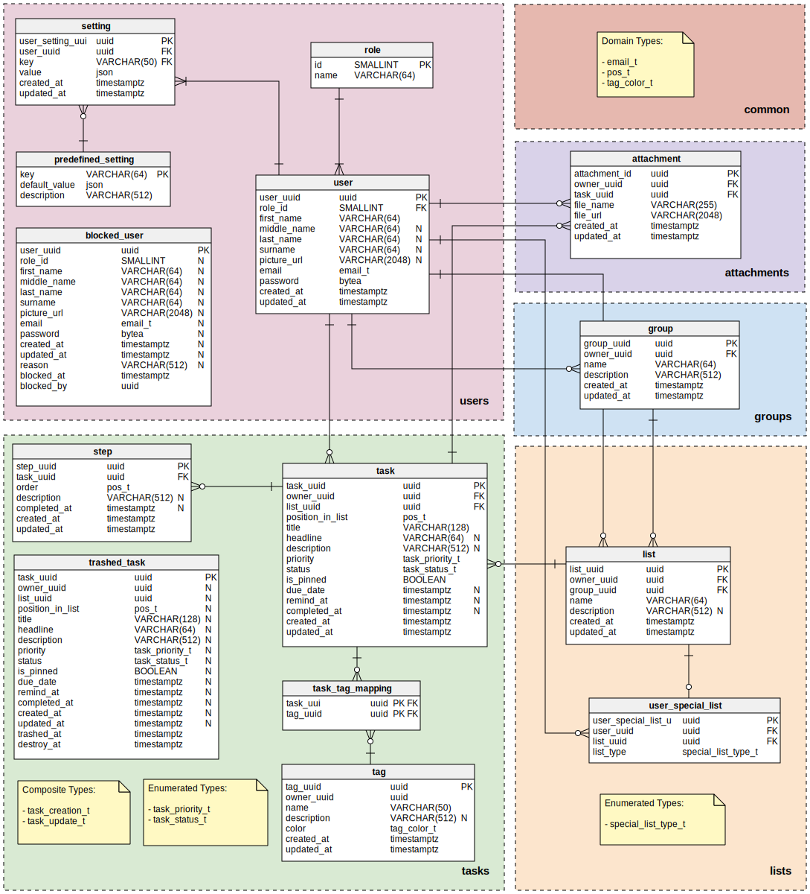

<div align="center">
  

---
  
  
</div>

**NODA** is a task management RESTful API designed to simplify the process of managing tasks, lists, and user
interactions. This is the PostgreSQL database repository for the **NODA** project.


*Entity–relationship model for the **NODA** database (designed with [Vertabelo](https://vertabelo.com/)).*

## Installation

For installing the database, follow the instructions
provided [in this repository](https://github.com/fontseca/noda).

## Project structure

Each directory represents the name of a database schema; inside each of them you can expect at least one of the
following directories:

- **enums**: definition of [enumerated types](https://www.postgresql.org/docs/current/datatype-enum.html)
- **domains**: definition of [domain types](https://www.postgresql.org/docs/current/domains.html)
- **composites**: definition of [composite types](https://www.postgresql.org/docs/current/rowtypes.html)
- **tables**: definition of schema tables
- **functions**: definition schema of functions
- **procedures**: definition schema of procedures
- **seeds**: necessary seed data for the schema

### The `bootstrap.sh` file

The order of execution of all these files is determined in the `bootstrap.sh` script.

Use the `bootstrap.sh` to automatically re-create the database in your running `noda_database` container. To do so, use
the following command:

```shell
docker exec -it noda_database sh -c '$PROJECT_DIR/bootstrap.sh'
```

> **Note:**  `bootstrap.sh` is also an utility that helps to re-creating the database for any other host.

Every SQL sentence that is executed is wrapped by a transaction.

### The `init.sql` file

This file contains the basic database initialization commands. This file is not executed by the `bootstrap.sh` utility
since by the time the script is run, the database is expected to be already created.

The file is executed as an initialization script when the container is being created by Docker Compose.

### The `schemas.sql` file

This file contains the commands for creating the database schemas and installing the necessary extensions. It is the
first file to be executed in `boostrap.sh`.

## Cluster information

Inside the running Docker container (`noda_database`), the Postgres server is running on the default port (`5432`), but
for outside users, the cluster is available through the address: `0.0.0.0:7891`.

The `postgres` superuser is not used as the owner of the database and schema objects, instead I use the `worker` role
defined in the `init.sql` file.

The actual database is called `master` and its owned by the `worker` role.

The password for the `worker` role is `secret`.

### In a nutshell

* PostgreSQL server port: `7891`
* Database name: `master`
* Database owner: `worker`
* Role password: `secret`

## Database access

Once the Docker container is up and running, you can access the PostgreSQL database with this command:

```shell
docker exec -it noda_database psql -U worker -d master
```
